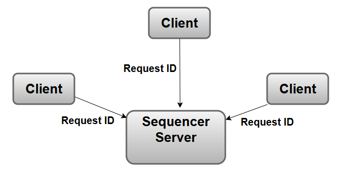
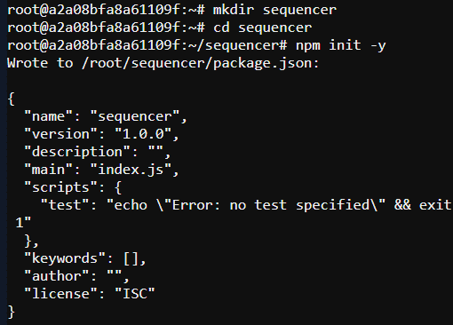
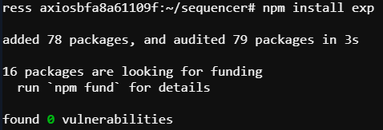
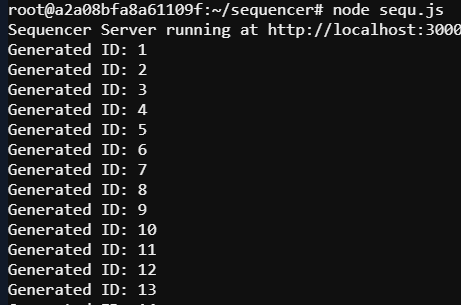
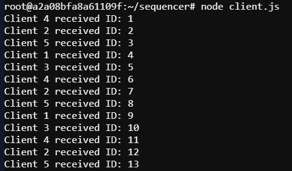

# Distributed Sequencer in Node.js for Generating Unique IDs

In this mini-project, we will create a **Distributed Sequencer** that generates **Unique IDs** for multiple clients. This system will ensure **Causality** and **Consistency**, so that even if multiple clients request IDs concurrently.

## **Basic Concepts**:

1. **Unique ID**: Each ID will be unique.
2. **Causality**: If one event occurs before another, its ID will be generated first.
3. **Consistency**: All clients will receive IDs in the same sequence without any conflicts.

## **Architecture**:


1. **Sequencer Server**: A central server (Sequencer) will generate IDs and distribute them to clients.
2. **Clients**: Multiple clients will connect to the Sequencer and request IDs.

## 🔹 Required Tools:
- **Node.js** (Check using: `node -v`)
- **npm** (Check using: `npm -v`)

## **Steps to Implement**:

### 1. **Go to the Project Folder and Initialize a Node.js Project:**

```bash
cd sequencer
npm init -y
```
<<<<<<< HEAD

=======

>>>>>>> 1a53b0c (update readme file)

### 2. **Install Dependencies:**
```bash
npm install express axios
```


### 3. **Create Files:**
- `sequ.js`
- `client.js`

### 4. **Run the System**:

   🚀 Start the Sequencer server: 
   ```bash
    node sequ.js   
   ```
<<<<<<< HEAD
    
=======
    
>>>>>>> 1a53b0c (update readme file)
     
  🚀 Start the Sequencer server: 
   ```bash
node client.js   
   ```
<<<<<<< HEAD
    
=======
    
>>>>>>> 1a53b0c (update readme file)
     
Multiple clients will request IDs from the Sequencer server and the sequencer server will use an incrementing counter to generate Unique IDs.

In this way, the generating unique id project as distributed sequencer is done.

